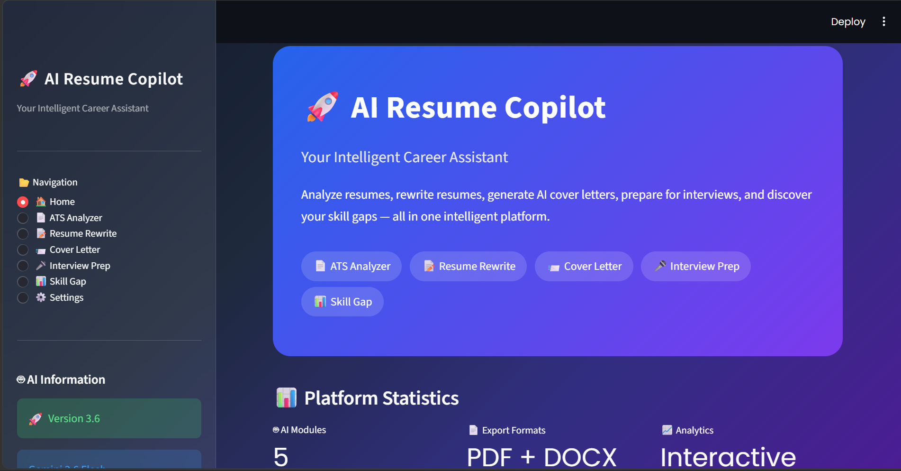
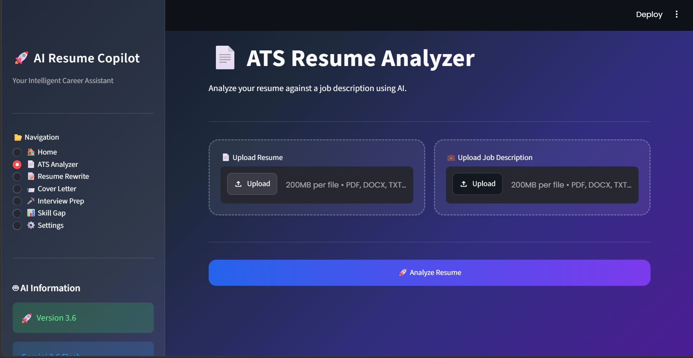
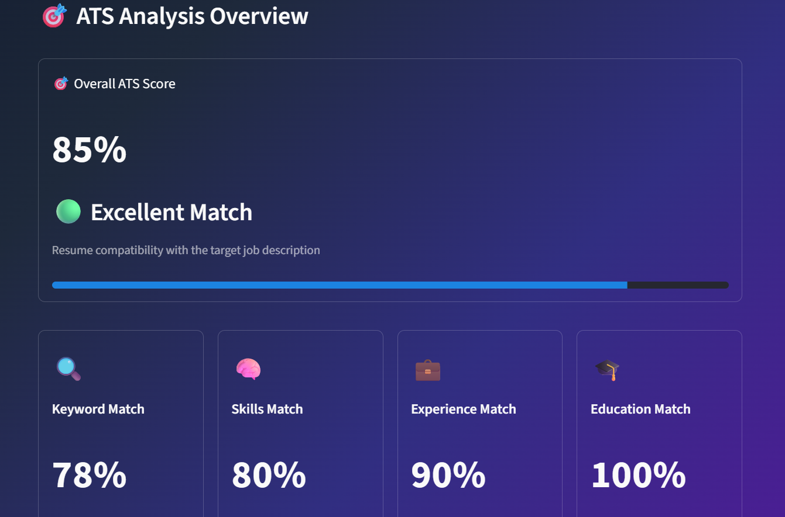
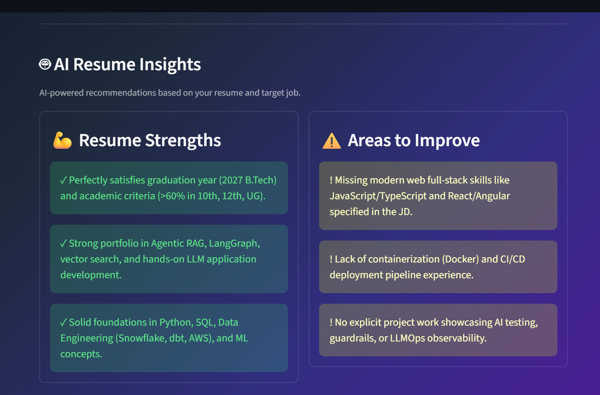

# 🚀 AI Resume Copilot

### 🌐 Live Demo

[Open AI Resume Copilot](https://ai-resume-copilot-itrdlzk3emjfhqshedv5cf.streamlit.app/)

An AI-powered career assistant built with **Python**, **Streamlit**, and **Google Gemini AI**.

AI Resume Copilot helps job seekers analyze, improve, and tailor their resumes while preparing for job applications and interviews.

---

## 📸 Application Screenshots

### 🏠 AI Resume Copilot



### 📄 ATS Resume Analyzer



### 📊 ATS Analysis Overview



### 💡 AI Resume Insights



---

## ✨ Features

### 📄 ATS Resume Analyzer

Analyze your resume against a target job description.

- ATS Compatibility Score
- Keyword Match Analysis
- Skills Match
- Experience Match
- Education Match
- Strengths & Weaknesses
- Improvement Suggestions
- Resume vs Job Description analysis

---

### 📝 AI Resume Rewrite

Rewrite and optimize your resume for a specific job description while keeping the information truthful.

- ATS-friendly rewriting
- Professional summary improvement
- Keyword optimization
- Skills optimization
- Project description improvement
- Grammar and wording improvements
- Truthfulness-focused AI instructions
- Markdown download
- Word (DOCX) download
- PDF download

---

### 📨 AI Cover Letter Generator

Generate a professional cover letter tailored to your resume and target job.

- Resume-based personalization
- Job-description tailoring
- ATS-friendly writing
- Professional tone
- Markdown download
- Word (DOCX) download
- PDF download

---

### 🎤 AI Interview Preparation

Generate a complete interview preparation guide based on your resume and target job.

- Target job role
- Interview difficulty
- Technical questions
- HR questions
- Behavioral questions
- Suggested answers
- Interview preparation tips

---

### 📊 AI Skill Gap Dashboard

Compare your current skills with the requirements of a target job.

- Overall skill readiness
- Matched skills
- Missing skills
- Skill match percentage
- Interactive skill analytics
- Learning roadmap
- Recommended portfolio projects
- Recommended certifications
- Estimated learning time

---

## 🛡️ Error Handling

The application includes production-oriented error handling for:

- Gemini API quota errors
- Gemini server errors
- AI generation failures
- Resume extraction failures
- Job description extraction failures
- PDF generation failures
- DOCX generation failures
- File processing errors

Users receive friendly error messages instead of raw application tracebacks.

---

## 🧰 Technology Stack

- **Python**
- **Streamlit**
- **Google Gemini AI**
- **Pandas**
- **Plotly**
- **PyPDF**
- **python-docx**
- **ReportLab**
- **Pytesseract**
- **Pillow**
- **python-dotenv**

---

## 📁 Project Structure

```text
AI-Resume-Copilot/
│
├── app/
│   ├── ai/
│   ├── pages/
│   ├── readers/
│   ├── services/
│   ├── ui/
│   └── utils/
│
├── data/
├── docs/
├── reports/
├── tests/
│
├── .gitignore
├── requirements.txt
├── README.md
└── streamlit_app.py